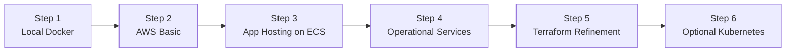
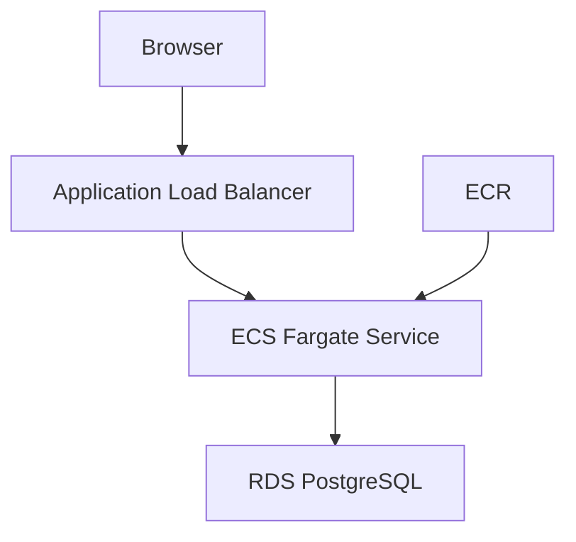
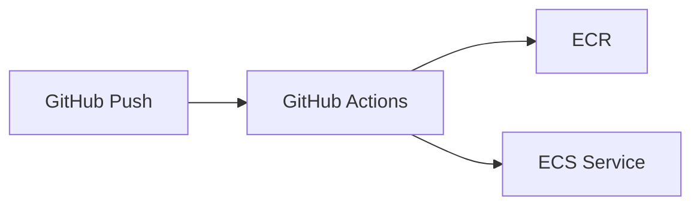

# ArcNote AWS Infra Learning Roadmap

## 目的

この文書は、ArcNote を題材にしながら、アプリケーションエンジニアとして AWS インフラを一通り理解できる状態まで段階的に進むためのロードマップです。

目標は、いきなり Kubernetes に入ることではありません。

- アプリをクラウドに載せる
- ネットワークと DB を理解する
- Terraform で再現可能にする
- CI/CD でデプロイを自動化する
- 実務でよく使う AWS サービスの役割を説明できる

ここまでを先に押さえたうえで、必要になったら Kubernetes や GitOps へ進みます。

## 前提

- AWS はほぼ初学に近い
- ただし、最終的には実務に近い説明力と実装経験を持ちたい
- ArcNote は学習記録アプリとして、backend / frontend / infra を 1 リポジトリで管理する

## ゴール

このロードマップの到達点は次の状態です。

- VPC、subnet、security group の役割を説明できる
- ECS Fargate でアプリを動かせる
- RDS PostgreSQL とアプリの接続を構築できる
- ECR に image を push し、GitHub Actions からデプロイできる
- Terraform modules と envs を分けて環境管理できる
- Route 53、ACM、ALB、Secrets Manager の役割を理解している

## 全体ステップ



## Step 1: ローカルで動作の流れを理解する

### 目的

クラウドに行く前に、アプリがどう起動し、どう DB とつながるかをローカルで理解する。

### やること

- `backend` を PostgreSQL 保存まで進める
- `docker-compose.yml` で backend と PostgreSQL を起動する
- `.env` または環境変数で接続先を切り替える
- DB migration の流れを確認する

### この段階で理解したいこと

- アプリの実行に必要な設定は何か
- アプリがどのタイミングで DB に接続するか
- コンテナ化すると何が閉じ込められるのか

### 完了条件

- ローカルで backend が起動する
- PostgreSQL に保存できる
- アプリ起動に必要な環境変数を説明できる

## Step 2: AWS の基本サービスを理解する

### 目的

まず Kubernetes ではなく、AWS の基本サービスを理解する。

### 対象サービス

- VPC
- public subnet / private subnet
- security group
- ECR
- ECS Fargate
- RDS for PostgreSQL

### やること

- AWS コンソールと Terraform の両方でサービスの役割を確認する
- ArcNote 用に `dev` 環境だけを作る前提で構成を決める
- ECS タスクが private subnet で動く構成を理解する
- DB は private subnet 側へ置く

### 理解ポイント

- VPC は AWS 上のネットワーク境界
- subnet は配置場所の単位
- security group は通信許可ルール
- ECS Fargate はコンテナ実行基盤
- ECR は image 保管場所
- RDS はマネージド DB

### 完了条件

- ArcNote の AWS 構成図を言葉で説明できる
- backend がどのサービスに依存するか説明できる

## Step 3: ArcNote を ECS Fargate に載せる

### 目的

アプリを AWS へデプロイし、クラウド上で動かす経験を得る。

### 推奨構成



### やること

- backend の Docker image を作る
- ECR に push する
- ECS Task Definition を作る
- ECS Service を作る
- RDS PostgreSQL を作る
- security group で ECS から RDS への接続だけ許可する

### 学ぶ内容

- コンテナ image をクラウドへ持っていく流れ
- タスク定義とサービスの違い
- ALB 経由で HTTP を受ける仕組み
- DB を private に置く意味

### 完了条件

- AWS 上で ArcNote backend が応答する
- RDS と接続できる
- デプロイに必要な AWS リソースを説明できる

## Step 4: 実務でよく出る周辺サービスを足す

### 目的

単に動く状態から、運用を意識した構成へ進める。

### 対象サービス

- ALB
- Route 53
- ACM
- CloudWatch Logs
- Secrets Manager または SSM Parameter Store

### やること

- カスタムドメインを Route 53 で管理する
- ACM で証明書を発行する
- ALB に HTTPS を設定する
- アプリログを CloudWatch Logs で確認する
- DB 接続情報を Secrets Manager か SSM に寄せる

### 理解ポイント

- なぜ本番で HTTPS が必要か
- DNS と証明書がどうつながるか
- なぜ secrets を Git に置かないのか
- ログがどこに集まるべきか

### 完了条件

- HTTPS で backend にアクセスできる
- ログ確認と secret 管理の流れを説明できる

## Step 5: Terraform を実務っぽく整理する

### 目的

AWS を手動で作るのではなく、再現可能な IaC として管理する。

### 推奨ディレクトリ

```text
infra/terraform/
  modules/
    network/
    database/
    compute/
    ecr/
  envs/
    dev/
    prod/
```

### やること

- `modules/network` に VPC、subnet、routing をまとめる
- `modules/database` に RDS をまとめる
- `modules/compute` に ECS、ALB、関連 IAM をまとめる
- `modules/ecr` に image repository をまとめる
- `envs/dev` と `envs/prod` で root module を分ける
- Terraform remote state と locking を入れる

### 理解ポイント

- module と env を分ける理由
- state をローカルに置かない理由
- 複数環境で同じ設計を再利用する考え方

### 完了条件

- `dev` を Terraform で再作成できる
- `prod` を変数差分で構成できる
- remote state と lock の意味を説明できる

## Step 6: CI/CD を実装する

### 目的

手動デプロイから卒業して、実務に近い変更フローを作る。

### やること

- GitHub Actions で backend image を build する
- ECR に push する
- ECS Service の更新を自動化する
- `terraform plan` を CI で回す

### フロー



### 理解ポイント

- build と deploy を分ける意味
- 手元から直接 apply しない理由
- Git ベース運用の利点

### 完了条件

- push をきっかけに build と deploy が走る
- 変更履歴から誰が何を反映したか追える

## Step 7: Optional Kubernetes

### 位置づけ

この段階まで来たあとで、必要なら Kubernetes へ進む。

### なぜ後回しか

- 先に AWS の基本構成を理解した方が、Kubernetes の責務が見えやすい
- いきなり EKS へ行くと、AWS と Kubernetes の両方で詰まりやすい
- ECS/Fargate を知った上で EKS を見ると、Kubernetes を採用する理由を比較しやすい

### 進むときのテーマ

- EKS
- Kubernetes manifests
- Ingress Controller
- GitOps
- ArgoCD

## ArcNote における推奨順序

```text
1. backend を PostgreSQL 保存まで進める
2. Docker Compose で backend + postgres を整える
3. AWS dev 環境を ECS Fargate で作る
4. RDS と接続する
5. ALB + Route 53 + ACM で HTTPS 化する
6. Secrets Manager / CloudWatch Logs を入れる
7. Terraform modules/envs を整理する
8. GitHub Actions で build/deploy を自動化する
9. 必要になったら EKS を検討する
```

## 学習優先順位

最優先で理解するもの:

- VPC
- subnet
- security group
- ECS Fargate
- RDS
- ECR
- Terraform 基本

次に理解するもの:

- ALB
- Route 53
- ACM
- CloudWatch Logs
- Secrets Manager
- GitHub Actions

後回しでよいもの:

- EKS
- ArgoCD
- Service Mesh
- advanced autoscaling

## 実務に近づくための注意点

- `latest` タグは使わない
- secrets を Git に置かない
- Terraform state は remote + lock 前提にする
- security group は最小権限で切る
- DB は public に置かない
- 本番相当では HTTPS を前提にする
- 手元からの直接デプロイを常態化させない

## 今の ArcNote で次にやるべきこと

直近の優先順位は次です。

1. backend の persistence を PostgreSQL 前提へ寄せる
2. `docker-compose.yml` で backend + postgres を整える
3. AWS 向けインフラ設計書を作る
4. Terraform の `network / database / compute / ecr` の枠を作る
5. `envs/dev` から着手する
