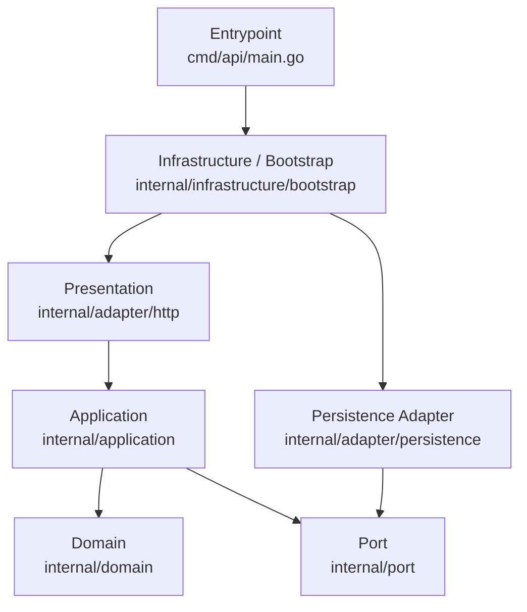
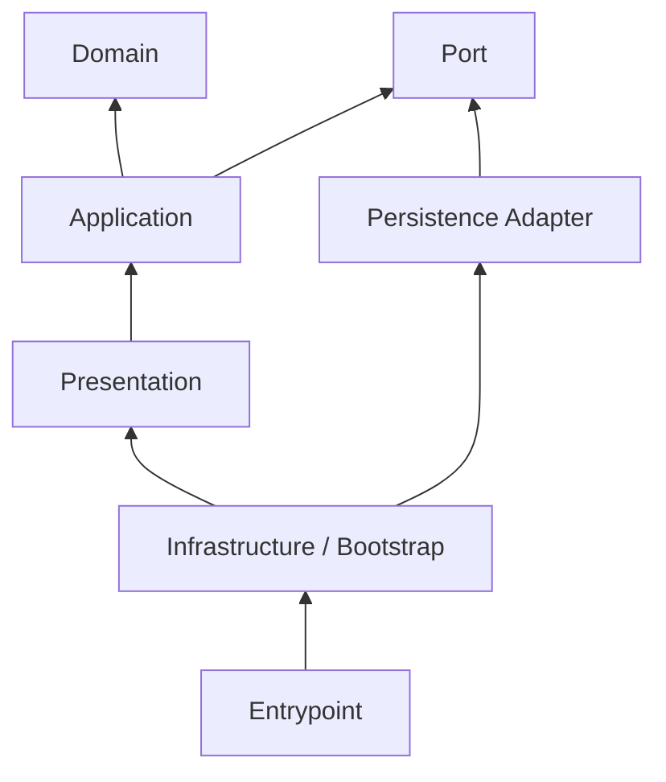
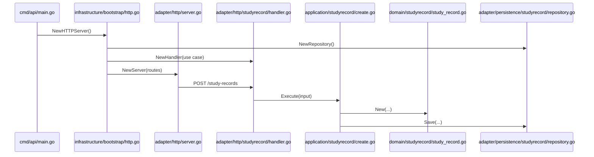

# Backend Layer Mapping

## 目的

この文書は、`backend/` 配下の各ファイルがレイヤードアーキテクチャのどの層に属するかを明示するためのものです。

設計方針そのものは `docs/architecture-guidelines.md` を参照し、この文書では「今あるファイルをどこに置くべきか」「新しいファイルをどこへ置くべきか」を判断しやすくすることを目的にします。

## 採用している層

ArcNote backend は、現在次の 6 分類で整理します。

1. Entrypoint
2. Presentation
3. Application
4. Domain
5. Port
6. Infrastructure / Adapter

## 全体レイヤー図



## 層ごとの責務

### 1. Entrypoint

- 実行可能ファイルの起動点
- プロセス起動とサーバー起動に専念する
- 具体的なユースケースや repository の生成責務は持たせない

### 2. Presentation

- HTTP リクエストを受ける
- リクエストを application 層の入力へ変換する
- レスポンスの形式やステータスコードを決める

### 3. Application

- ユースケースを表現する
- domain と port を組み合わせて処理を進める
- HTTP や DB の詳細は持ち込まない

### 4. Domain

- ビジネスルールを保持する
- エンティティやバリデーションを表現する
- 外部 I/O やフレームワークに依存しない

### 5. Port

- application 層が必要とする外部依存の抽象を定義する
- repository や notifier などの interface を置く
- 実装詳細は持たない

### 6. Infrastructure / Adapter

- port の実装を置く
- 依存関係の組み立てを置く
- 外部 I/O やフレームワークとの接続を担当する

## 現在のファイル対応表

### Entrypoint

- `backend/cmd/api/main.go`
- `backend/cmd/api/main_test.go`

### Presentation

- `backend/internal/adapter/http/server.go`
- `backend/internal/adapter/http/server_test.go`
- `backend/internal/adapter/http/studyrecord/handler.go`
- `backend/internal/adapter/http/studyrecord/handler_test.go`

### Application

- `backend/internal/application/studyrecord/create.go`
- `backend/internal/application/studyrecord/create_test.go`

### Domain

- `backend/internal/domain/studyrecord/study_record.go`
- `backend/internal/domain/studyrecord/study_record_test.go`

### Port

- `backend/internal/port/study_record_repository.go`
- `backend/internal/port/study_record_repository_test.go`

### Infrastructure / Adapter

- `backend/internal/adapter/persistence/studyrecord/repository.go`
- `backend/internal/adapter/persistence/studyrecord/repository_test.go`
- `backend/internal/infrastructure/bootstrap/http.go`
- `backend/internal/infrastructure/bootstrap/http_test.go`

## 依存ルールの図



## 今の依存の流れ

現在の study-record 作成処理は、次の層を通ります。

```text
cmd/api/main.go
  -> internal/infrastructure/bootstrap/http.go
  -> internal/adapter/http/server.go
  -> internal/adapter/http/studyrecord/handler.go
  -> internal/application/studyrecord/create.go
  -> internal/domain/studyrecord/study_record.go
  -> internal/port/study_record_repository.go
  -> internal/adapter/persistence/studyrecord/repository.go
```



## ファイル配置ルール

### `cmd/`

- サーバー起動や CLI 起動など、実行入口だけを置く
- handler や use case の組み立てを書き込みすぎない

### `internal/adapter/http/`

- ルーター
- ハンドラー
- HTTP リクエストとレスポンスの変換

ここに置かないもの:

- ビジネスルール
- 永続化処理

### `internal/application/`

- use case
- アプリケーションサービス
- domain と port を使った処理の流れ

ここに置かないもの:

- SQL
- HTTP ステータスコード
- JSON の decode / encode

### `internal/domain/`

- エンティティ
- 値オブジェクト
- ドメインルール

ここに置かないもの:

- `net/http`
- DB ドライバ
- repository 実装

### `internal/port/`

- repository interface
- 外部サービス interface

ここに置かないもの:

- 実装コード
- 具体的な接続設定

### `internal/adapter/persistence/`

- port の永続化実装
- DB アクセスの詳細
- 将来的な PostgreSQL 実装

### `internal/infrastructure/`

- dependency injection
- bootstrap
- config
- DB 接続生成

## 迷ったときの判断基準

- HTTP 固有の都合があるなら Presentation
- ユースケースの流れを表現しているなら Application
- ビジネスルールそのものなら Domain
- application が必要とする抽象なら Port
- 抽象の具体実装や依存組み立てなら Infrastructure / Adapter

## 今後追加予定のファイルの置き場

- PostgreSQL 接続設定: `internal/infrastructure/`
- PostgreSQL の study record repository 実装: `internal/adapter/persistence/`
- study record の取得 use case: `internal/application/studyrecord/`
- study record の一覧 API handler: `internal/adapter/http/studyrecord/`

## 注意

- `internal/adapter/` と `internal/infrastructure/` はどちらも外側の層ですが、役割は分けます
- `adapter` は外部入出力の具体実装、`infrastructure` は組み立てと設定に寄せます
- テストファイルは原則として、本体ファイルと同じ層の補助として扱います
